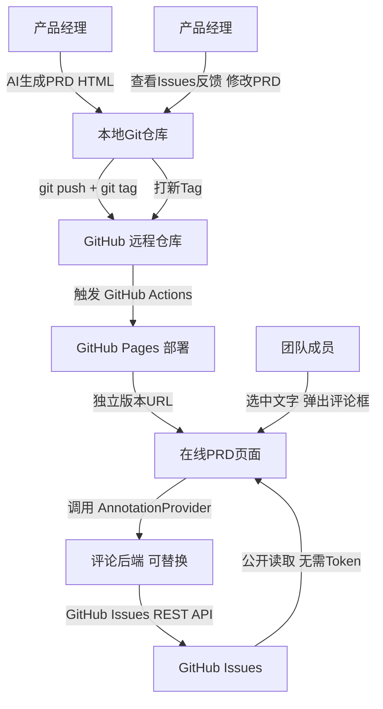

# AI Docs Hub — 技术方案规划

## 背景与痛点

1. **跨团队协作与同步**：PRD / 技术文档由 AI 生成为静态 HTML/Markdown，保存在本地，无法共享；版本更新时难以追踪变化。
2. **缺乏行内评论**：无法像飞书云文档那样选中特定文字添加评论并进行回复。

---

## 🏗️ 整体架构



---

## 1. 平台选择

| 阶段 | 平台 | 说明 |
|------|------|------|
| **Demo** | **GitHub** | Pages + Issues + Actions，快速验证 |
| 后续 | GitLab / 自建 | 通过抽象层平滑迁移，无需重写业务逻辑 |

---

## 2. 版本管理：GitHub Pages + Git Tags

- 文档以静态 HTML 存入 Git 仓库
- 每个正式评审版本打一个 Tag（如 `v1.0`、`v2.3`）
- GitHub Actions 监听 Tag 推送，自动部署对应版本到 GitHub Pages
- 每个版本拥有**永久独立 URL**，便于分发和存档

**操作流程：**
```bash
git tag v1.0
git push origin v1.0
# → 自动触发部署，生成 https://{user}.github.io/{repo}/v1.0/
```

---

## 3. 文字选中标注机制

原有方案（Vssue 等）仅支持**页面级评论**，不满足"选中文字添加评论"的需求。新方案：

1. 用户在渲染后的 HTML 页面选中文字
2. 前端捕获 `Selection` 对象，弹出评论输入框
3. 用户填写评论内容后提交
4. 前端调用 `AnnotationProvider.createAnnotation(anchor, comment)` 写入后端
5. 页面加载时调用 `AnnotationProvider.listAnnotations(docId, version)` 读取所有标注
6. 在原文对应位置渲染高亮 + 侧边评论面板

**页面展示效果（示意）：**
```
┌─────────────────────────────┬──────────────────────┐
│  PRD 文档正文               │  📌 评论面板          │
│                             │                      │
│  这段文字需要确认 [1]        │  Issue #3            │
│  ------------------         │  "这段文字需要确认"   │
│  其他内容...         [2]    │  王工: 已和产品确认   │
└─────────────────────────────┴──────────────────────┘
```

---

## 4. 评论后端抽象层（依赖注入风格）

为了让评论后端可灵活替换，定义统一的 `AnnotationProvider` 接口：

```
AnnotationProvider (Interface)
├── createAnnotation(anchor, comment, meta) → annotationId
├── listAnnotations(docId, version) → Annotation[]
├── replyToAnnotation(annotationId, reply) → void
└── deleteAnnotation(annotationId) → void
```

**可注入的实现：**

| 实现类 | 适用场景 |
|--------|---------|
| `GitHubIssueProvider` | Demo 阶段，PAT Token 鉴权 |
| `GitLabIssueProvider` | 迁移 GitLab 后 |
| `LocalFileProvider` | 离线/纯本地场景 |
| `CustomBackendProvider` | 接入自建后端 |

切换实现只需修改注入配置，业务层代码不变。

---

## 5. Demo 阶段鉴权方案

| 操作 | 是否需要 Token | 说明 |
|------|--------------|------|
| **读取标注**（Issues 列表） | ❌ 不需要 | 公开仓库免认证 |
| **写入标注**（创建 Issue） | ✅ 需要 PAT | Fine-grained PAT，仅需 Issues: Read & Write |

PAT Token 作用域极小，Demo 阶段存入环境变量即可，后续再做更完善的鉴权。

---

## 6. 评论与版本的隔离逻辑

- 每条标注的 Issue 携带 `version: v1.0` 等元数据（存入 Issue Label 或 Body）
- 不同版本的文档读取各自版本的标注，**互不干扰**
- 旧版本标注永久保留，实现"版本快照 + 评论快照"

---

## 🚀 实施步骤（高层）

1. 在 GitHub 创建仓库，准备示例 PRD HTML
2. 配置 GitHub Actions，实现 Tag 推送 → GitHub Pages 自动部署
3. 实现前端文字选中捕获与高亮渲染逻辑
4. 实现 `AnnotationProvider` 接口及 `GitHubIssueProvider`
5. 联调：选中文字 → 创建 Issue → 读回并渲染
6. 验证版本隔离：分别为 `v1.0` 和 `v1.1` 打 Tag，确认标注互不影响

---

## 💎 方案总结

| 痛点 | 解决方式 |
|------|---------|
| 文档在线化与版本管理 | Git Tags + GitHub Pages + Actions 自动部署 |
| 文字选中行内评论 | 前端 Selection API + AnnotationProvider 写入 Issues |
| 评论可见性与版本绑定 | Issues 携带版本元数据，按版本隔离读取渲染 |
| 后端可替换性 | AnnotationProvider 接口抽象，依赖注入风格切换实现 |
